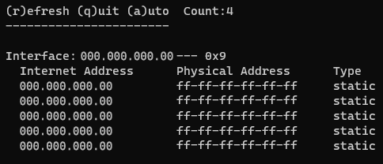

<h1 align="center">arp-pdcurses</h1>
<p align="center">
Aka ArpPDC - simple pdcurses TUI for "arp -a" command (Windows os). This is a simple pet project.
</p>
<p align="center">
This program is released under license GPL-3.0 or later.
  <a href="https://GitHub.com/gH2843/arp-pdcurses/releases/">
    
  </a>
</p>
<p align="center">

</p>

## Install
- Install [MSYS2](https://www.mingw-w64.org/downloads/)
- Run MSYS2 and move curses.h to "include" and pdcurses.a to "lib" directory this project:
```console
$ git clone https://github.com/gH2843/arp-pdcurses.git
$ git clone https://github.com/wmcbrine/PDCurses.git
$ cd PDCurses/wincon && mingw32-make -f Makefile -j
$ mkdir ../../arp-pdcurses/build ../../arp-pdcurses/include ../../arp-pdcurses/lib
$ mv ../curses.h ../../arp-pdcurses/include
$ mv pdcurses.a ../../arp-pdcurses/lib
$ cd ../../arp-pdcurses/build && rm -rf ../../PDCurses
```
- Run CMake file:
```console
$ cmake ../ && make -j
```
**Note: dependency: [pdcurses](https://github.com/wmcbrine/PDCurses)**
## Roadmap
- [ ] Save temp files to temp system directory
- [x] ~~Disclaimer was not displayed on further launches~~
- [ ] Processing of termination signals